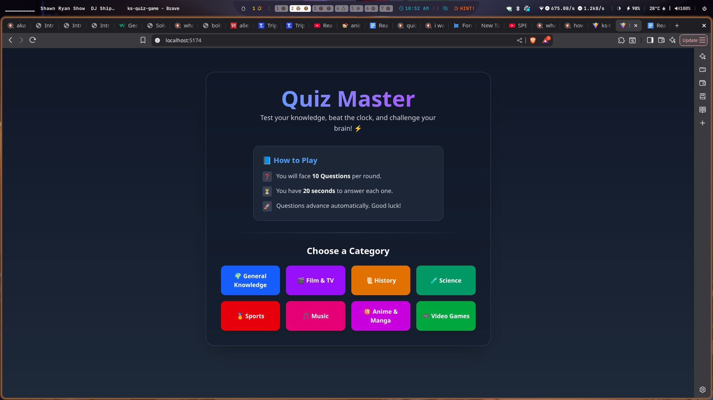
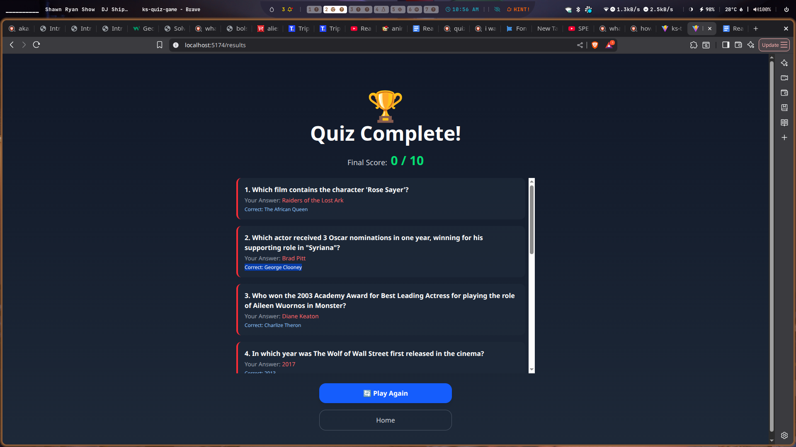

# Ks Quiz Game

# About

This quiz game starts with you choosing a category of questions you will want to answer after that you will have 10 questions when you are dona answering you will be give your results and if you had some wrong you will be give the correct answers

## Built With

- Javascript
- React
- Tailwind
- Zustand

## Clone project

- To get a local copy up and running follow these simple example steps.
- Clone this repository with `https://git@github.com:JaffDavy/ks-quiz-game.git` using your terminal or command line.

## Command line steps

- $ git clone `$ git@github.com:JaffDavy/ks-quiz-game.git`

## Start App

- run `npm install`
- run `npm start` in your command line

## Live Site

[Link](ks-quiz-game-git-development-jaffdavys-projects.vercel.app)

## Author

👤 **Jaff Davy-Arnold**

- GitHub: [@JaffDavy](https://github.com/JaffDavy/)
- LinkedIn: [Jaff Davy-Arnold](https://www.linkedin.com/in/jaff-davy-arnold-5ba749297/)
